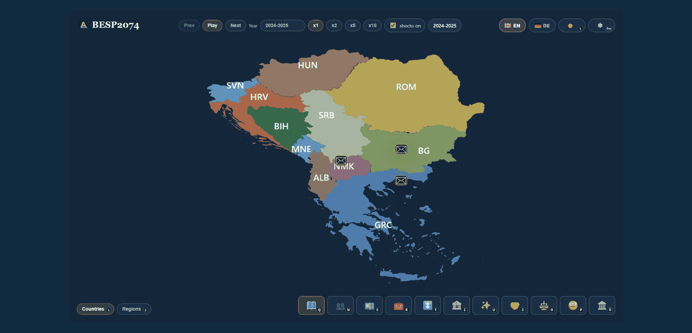
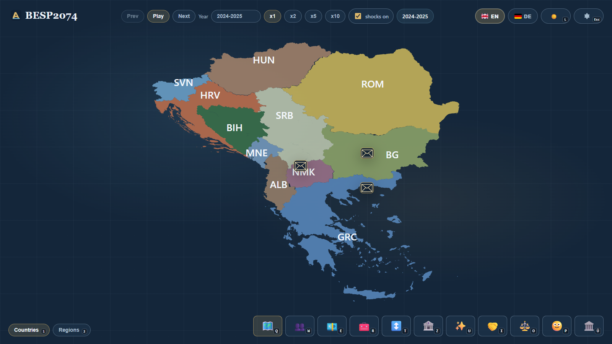

# BESP2074 - Balkan Economy Simulation Player

**Deutsch** | [English](./README_EN.md)

BESP2074 ist eine lokale Balkan-Simulation bis `2074`. Das Projekt verbindet ein Python-Simulationsmodell mit JSON-Export, interaktivem Web-Dashboard, Kartenansicht, Szenarien, Schocks und einem Grenzeditor.

Das Ziel ist eine anschauliche Portfolio-Demo: Man startet eine Simulation, schaut sich die Entwicklung auf der Karte an und kann verschiedene Kennzahlen oder Szenarien vergleichen.

## Demo





## Funktionen

- Interaktive Balkan-Karte mit Länder- und Regionsansicht
- Timeline bis `2074` mit Play-, Next- und Speed-Steuerung
- Szenarien mit reproduzierbaren Seeds
- Optionale simulierte Schocks
- KPI-Modi für Bevölkerung, GDP, Arbeitslosigkeit, Inflation und weitere Werte
- Lokaler Grenzeditor für Karten-Overrides und Annexionsszenarien

## Schnellstart

```powershell
git clone https://github.com/AleksZyro/BESP2074.git
cd BESP2074
python -m pip install -r requirements-dev.txt
python tools\local_run_service.py --port 8011
```

Danach öffnen:

- Dashboard: <http://127.0.0.1:8011/dashboard/index.html>
- Grenzeditor: <http://127.0.0.1:8011/dashboard/editor.html>

Eine ausführlichere Schritt-für-Schritt-Anleitung steht im [Installationsguide](./docs/INSTALLATION.md).

## Simulation starten

```powershell
python main.py --scenario baseline
python main.py --scenario baseline --disable-shocks
python main.py --scenario reform --seed reform-a
python main.py --list-scenarios
```

Die Simulation schreibt den aktuellen Run nach `output/latest.json`. Das Dashboard liest diese Datei über den lokalen Python-Service.

## Länderumfang

- Albanien
- Bosnien und Herzegowina
- Bulgarien
- Griechenland
- Kroatien
- Montenegro
- Nordmazedonien
- Rumänien
- Serbien
- Slowenien
- Ungarn

## Projektaufbau

- `main.py`: CLI-Einstieg für Simulationen
- `besp/`: Simulationsmodell, Loader, Exporter und Validierung
- `data/`: Länder, Regionen, Szenarien und Schocks
- `dashboard/`: HTML, CSS, JavaScript, Kartenansicht und Editor
- `tools/local_run_service.py`: lokaler Dashboard- und Run-Service
- `docs/`: Installation und Screenshots

<details>
<summary>Rechtliches</summary>

BESP2074 ist eine Lern- und Szenariosimulation. Die Ergebnisse sind keine echten Prognosen und keine Entscheidungshilfe für Politik, Wirtschaft oder Finanzen.

Der eigene Quellcode und die eigene Projektdokumentation stehen unter der MIT-Lizenz in `LICENSE`.

Drittanbieter-Daten und Geodaten behalten ihre eigenen Lizenzen und Nutzungsbedingungen. Weitere Hinweise stehen in `THIRD_PARTY_NOTICES.md`.

</details>
