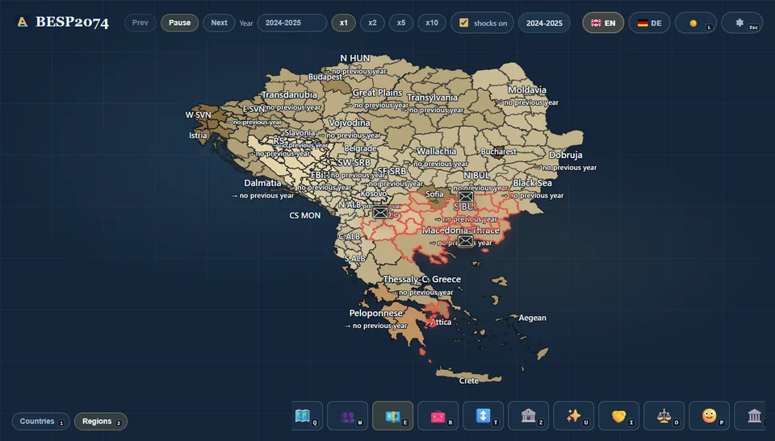

# BESP2074 - Balkan Economy Simulation Player

[Deutsch](./README.md) | **English**

BESP2074 is a local Balkan simulation up to `2074`. The project combines a Python simulation model, JSON export, an interactive web dashboard, a map view, scenarios, shocks, and a boundary editor.

The goal is a clear portfolio demo: start a simulation, inspect the development on the map, and compare indicators or scenarios.

## Demo




## Features

- Interactive Balkan map with country and region view
- Timeline up to `2074` with play, next, and speed controls
- Scenarios with reproducible seeds
- Optional simulated shocks
- KPI modes for population, GDP, unemployment, inflation, and more
- Local boundary editor for map overrides and annexation scenarios

## Quick Start

```powershell
git clone https://github.com/AleksZyro/BESP2074.git
cd BESP2074
python -m pip install -r requirements-dev.txt
python tools\local_run_service.py --port 8011
```

Then open:

- Dashboard: <http://127.0.0.1:8011/dashboard/index.html>
- Boundary editor: <http://127.0.0.1:8011/dashboard/editor.html>

A more detailed step-by-step guide is available in the [Installation Guide](./docs/INSTALLATION_EN.md).

## Run a Simulation

```powershell
python main.py --scenario baseline
python main.py --scenario baseline --disable-shocks
python main.py --scenario reform --seed reform-a
python main.py --list-scenarios
```

The simulation writes the current run to `output/latest.json`. The dashboard reads this file through the local Python service.

## Country Scope

- Albania
- Bosnia and Herzegovina
- Bulgaria
- Croatia
- Greece
- Hungary
- Montenegro
- North Macedonia
- Romania
- Serbia
- Slovenia

## Project Structure

- `main.py`: CLI entry point for simulations
- `besp/`: simulation model, loader, exporter, and validation
- `data/`: countries, regions, scenarios, and shocks
- `dashboard/`: HTML, CSS, JavaScript, map view, and editor
- `tools/local_run_service.py`: local dashboard and run service
- `docs/`: installation and screenshots

<details>
<summary>Legal</summary>

BESP2074 is a learning and scenario simulation. Its results are not real forecasts and are not decision support for politics, economics, or finance.

The self-authored source code and project documentation are licensed under the [MIT Licence](./LICENSE).

Third-party data and geodata keep their own licences and terms of use. Further notes are listed in the [Third-Party Notices](./THIRD_PARTY_NOTICES.md).

</details>
